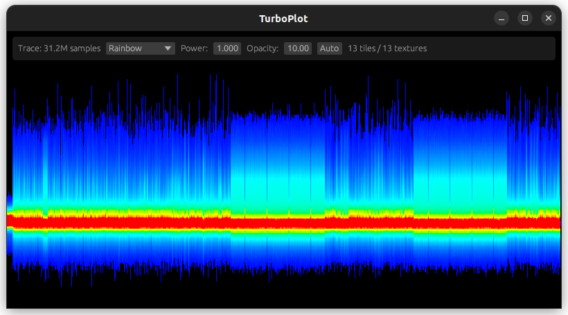

# TurboPlot

TurboPlot is a blazingly fast waveform renderer made for visualizing huge traces.

Traces are displayed using a density rendering algorithm distributed across GPU and CPU threads, enabling very smooth navigation even with traces as big as 1 Giga samples! The density rendering allows analyzing traces easily on a large scale, while also preserving single-sample peaks visible.

When the sampling rate is configured, time intervals can be measured easily. The interval selection tools can also help in counting repetitive patterns in traces.



## Installation

Rust shall be installed on your system (see [instructions](https://www.rust-lang.org/tools/install) for installation).
TurboPlot can be directly installed by cargo:

```
cargo install turboplot
```

## Usage

```
turboplot waveform.npy
```

Alternatively, you can build and run by cloning this repository and execute:

```
cargo run --release -- waveform.npy
```

TurboPlot can open numpy or CSV files. When loading a CSV file, `--skip-lines` shall be specified to skip header lines, and --column can indicate which data column must be parsed and rendered. Column indexing starts by 0.

```
# Load CSV trace, skip first 10 lines and display third column.
# --format is optional if the file path ends with .csv.
turboplot --format csv --skip-lines 10 --column 2 waveform.csv
```

Multiple traces can be opened in horizontal split-screen, with their views optionally synchronized. This can be useful for comparing two traces:

```
turboplot waveform1.npy waveform2.npy
```

By default TurboPlot will spawn 1 GPU rendering thread and the maximum CPU rendering threads the hardware can run simultaneously. To fit your needs, this can be changed by specifying the number of threads for each type of rendering backend:

```
# Disable use of GPU rendering backend, use only 1 CPU rendering thread.
turboplot --gpu 0 --cpu 1 waveform.npy
```

Note: In this mode, the user interface may still use the GPU; The trace rendering will be performed only on the CPU.

Controls:
- Horizontal panning is performed using left or right mouse buttons.
- Vertical offset can be modified using Alt + left or right mouse drag.
- Horizontal zoom is performed using mouse wheel.
- Vertical zoom is performed using Alt + mouse wheel.
- UI can be scaled up using Ctrl + =.

## Limitations

This tool is experimental and still in development. TurboPlot can only open numpy files (.npy) with 1D arrays or CSV files. For the moment, only one trace can be displayed at a time.

## License

Licensed under either of

 * Apache License, Version 2.0
   ([LICENSE-APACHE](LICENSE-APACHE) or http://www.apache.org/licenses/LICENSE-2.0)
 * MIT license
   ([LICENSE-MIT](LICENSE-MIT) or http://opensource.org/licenses/MIT)

at your option.

## Contribution

Unless you explicitly state otherwise, any contribution intentionally submitted
for inclusion in the work by you, as defined in the Apache-2.0 license, shall be
dual licensed as above, without any additional terms or conditions.
