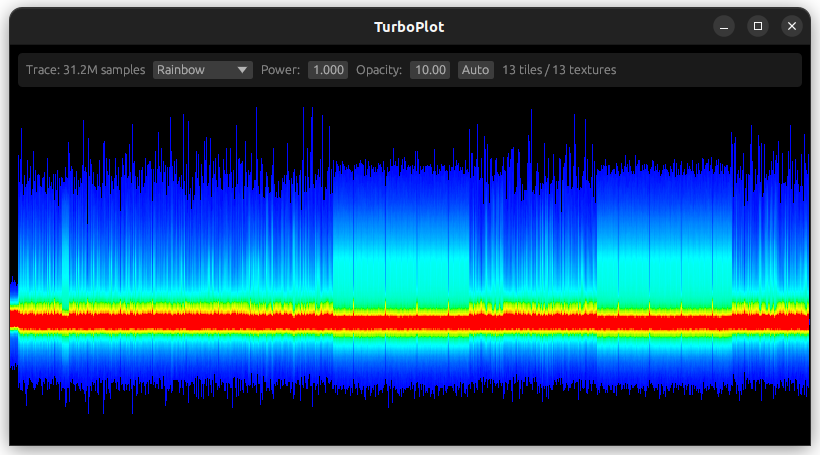

[](https://crates.io/crates/turboplot)

# TurboPlot

TurboPlot is a blazingly fast waveform renderer made for visualizing huge traces.

Traces are displayed using a density rendering algorithm distributed across GPU and CPU threads, enabling very smooth navigation even with traces as big as 1 Giga samples! The density rendering allows analyzing traces easily on a large scale, while also preserving single-sample peaks visible.

When the sampling rate is configured, time intervals can be measured easily. The interval selection tools can also help in counting repetitive patterns in traces.



## Installation

### Pre-built Binaries

You can download the latest pre-built binaries for Linux, Windows, and macOS from the [Releases page](https://github.com/Ledger-Donjon/turboplot/releases).

### From Source (cargo)

Rust shall be installed on your system (see [instructions](https://www.rust-lang.org/tools/install) for installation).
TurboPlot can be directly installed by cargo:

```
cargo install turboplot
```

## Usage

```
turboplot waveform.npy
```

Alternatively, you can build and run by cloning this repository and execute:

```
cargo run --release -- waveform.npy
```

### Supported formats

- **NumPy** (`.npy`): 1D arrays (single trace) and 2D arrays.
- **Tektronix WFM** (`.wfm`): versions 1, 2 and 3, including FastFrame files (one trace per frame).
- **CSV** (`.csv`): single-column or multi-column files.

The format is guessed from the file extension. It can be forced with `--format`.

When loading a CSV file, `--skip-lines` shall be specified to skip header lines, and `--column` can indicate which data column must be parsed and rendered. Column indexing starts at 0.

```
turboplot --format csv --skip-lines 10 --column 2 waveform.csv
```

### 2D NumPy arrays

Two conventions are commonly used for 2D `.npy` files:

- **Row-wise** — shape `(n_traces, pts)`, e.g. a stack of traces captured in FastFrame mode.
- **Column-wise** — shape `(pts, n_traces)`, e.g. oscilloscope dumps with a time column and one or more signal columns. Internally, the array is transposed so it is handled identically to the row-wise case.

In both cases, `--frames` selects which traces to load; indices refer to rows (row-wise) or to columns (column-wise), not to CSV-style data columns.

By default (`--npy-layout auto`) TurboPlot guesses from the shape: arrays with few columns and many rows are treated as column-wise, everything else as row-wise. The interpretation can be forced with `--npy-layout columns` or `--npy-layout rows`.

```
# Column-wise oscilloscope dump: 2 traces (e.g. time + voltage), keep only the second
turboplot --frames 1 waveform.npy

# Force row-wise interpretation and pick a few traces out of a multi-trace file
turboplot --npy-layout rows --frames 0-3,7 stack.npy
```

### Multi-trace files and frame selection

Files that contain multiple traces (row-wise 2D NumPy arrays, FastFrame WFM files) load all traces by default. You can select a subset with `--frames`:

```
turboplot --frames 0-3,7,10-12 capture.wfm
```

The format accepts comma-separated indices and ranges (e.g. `1-3,6,7-8,12`). `--frames` applies to any format independently of the layout: for files that produce a single trace (1D NumPy, CSV, column-wise 2D NumPy) only `--frames 0` is meaningful. To keep the UI responsive, TurboPlot caps the total number of split views to 64.

### Split-screen

Multiple traces can be opened in horizontal split-screen, with their views optionally synchronized. This can be useful for comparing two traces:

```
turboplot waveform1.npy waveform2.npy
```

### Filtering

Traces can be filtered with basic filters when they are loaded. Low-pass, high-pass, band-pass and notch filters are possible. This requires specifying the sampling rate (in MHz) and the cutoff frequency (in kHz).

```
cargo run --release -- -s 100 --filter low-pass --cutoff-freq 1000 waveform.npy
```

By default TurboPlot will spawn 1 GPU rendering thread and the maximum CPU rendering threads the hardware can run simultaneously. To fit your needs, this can be changed by specifying the number of threads for each type of rendering backend:

```
# Disable use of GPU rendering backend, use only 1 CPU rendering thread.
turboplot --gpu 0 --cpu 1 waveform.npy
```

Note: In this mode, the user interface may still use the GPU; The trace rendering will be performed only on the CPU.

Controls:
- Horizontal panning is performed using left or right mouse buttons.
- Vertical offset can be modified using Alt + left or right mouse drag.
- Horizontal zoom is performed using mouse wheel.
- Vertical zoom is performed using Alt + mouse wheel.
- UI can be scaled up using Ctrl + =.

## License

Licensed under either of

 * Apache License, Version 2.0
   ([LICENSE-APACHE](LICENSE-APACHE) or http://www.apache.org/licenses/LICENSE-2.0)
 * MIT license
   ([LICENSE-MIT](LICENSE-MIT) or http://opensource.org/licenses/MIT)

at your option.

## Contribution

Unless you explicitly state otherwise, any contribution intentionally submitted
for inclusion in the work by you, as defined in the Apache-2.0 license, shall be
dual licensed as above, without any additional terms or conditions.
