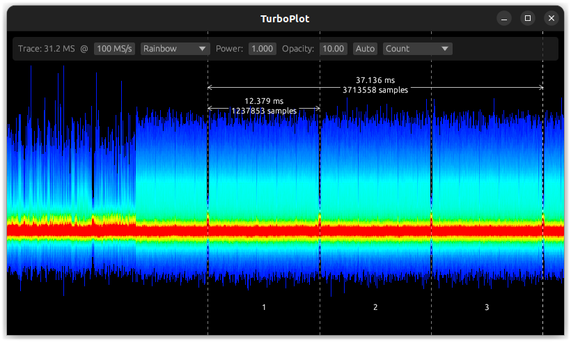

# TurboPlot

TurboPlot is a blazingly fast waveform renderer made for visualizing huge traces.

Traces are displayed using a density rendering algorithm performed on the GPU thanks to a compute shader, enabling very smooth navigation even with traces as big as 1 Giga samples! The density rendering allows analyzing traces easily on a large scale, while also preserving single-sample peaks visible.



# Usage

```
cargo run --release -- waveform.npy
```

Rendering is also possible using only CPU backend:

```
cargo run --release -- -b cpu waveform.npy
```

Note: In this mode, display still uses GPU. Only the trace rendering will be performed on the CPU.

## License

Licensed under either of

 * Apache License, Version 2.0
   ([LICENSE-APACHE](LICENSE-APACHE) or http://www.apache.org/licenses/LICENSE-2.0)
 * MIT license
   ([LICENSE-MIT](LICENSE-MIT) or http://opensource.org/licenses/MIT)

at your option.

## Contribution

Unless you explicitly state otherwise, any contribution intentionally submitted
for inclusion in the work by you, as defined in the Apache-2.0 license, shall be
dual licensed as above, without any additional terms or conditions.
